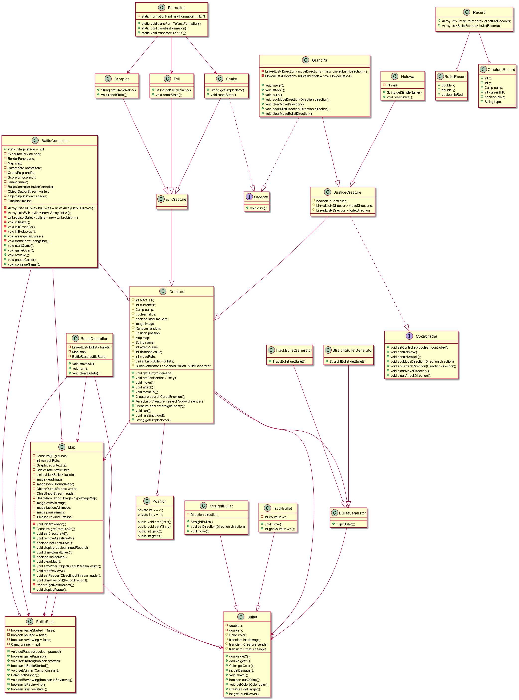

# Java 期末大作业 
171860525 计算机科学与技术系 陈善梁  
邮箱: 171860525@smail.nju.edu.cn

## 一、游戏操作说明
大作业的要求是“当某个生物体于敌方相遇（两者间的X轴距离和Y轴距离小于某个常量）时，选取一个概率决定双方生死”，当时我觉得这样的攻击方式太过粗暴，不能很好地体现真实的打斗伤害场景，而且可玩性较低。于是，在征得老师同意后，我改变了攻击的形式：发射不同类型的子弹。其他部分仍然按照大作业的要求完成。我把游戏界面设计成比较简洁的风格，所有操作都通过键盘完成。以下是游戏操作说明：  
1. 打开游戏后，进入初始界面，葫芦娃阵营在左侧按照长蛇阵排好，妖精阵营在右侧按照锋矢阵法排列:
2. 按下空格键选择距离文件保存的目录及文件名,开始游戏。在游戏过程中可以用方向键控制老爷爷移动，用WSAD控制老爷爷向上下左右四个方向发射子弹:![]开始(src/main/resources/md/start.png)
开始游戏后按下空格键则暂停游戏:
游戏结束:
按下L选择记录文件回放:
## 二、项目框架
五个package:battle,bullet,creature,formation和record，它们的职责如下:  
package|职责
:----:|----
battle|1. (BattleController.java) 负责UI组件(BorderPane、Canvas等)的初始化、战场元素(葫芦娃、妖精、子弹列表、子弹管理器、地图)的初始化、与记录有关的输入输出流(writer、reader)的声明、用于UI界面刷新的TimeLine的声明、线程池的声明 <br> 2. (BattleController.java) 监听键盘事件:空格键开始/暂停/继续游戏，F键改变阵型、L选择记录文件回放以及方向键控制移动等 <br> 3. (BattleController.java)实现对于键盘事件的相应函数，如startGame()、gameOver()、pauseGame()、continueGame()等。<br> 4. (Map.java)定义重要的战场地图Map类，负责控制访问和修改战场某一位置的生物、显示战斗过程中的每一帧画面、显示回放过程中的每一帧画面。该类由所有生物对象共享。<br> 5. (Config.java) 配置战场规格、不同生物特性，，如战场大小、行列数、生物攻击力等 <br> 6. (BattleState.java) 定义全局的BattleState类，表示当前状态:未开始、开始、暂停等。所有战场元素共享该对象。
creature|定义所有的生物，基类Creature、葫芦娃类Huluwa、老爷爷GrandPa和妖精Evil等
bullet|定义所有的子弹类及其工厂类。
formation|定义阵法Formation类，实现所有改变妖精阵型的方法
record|定义游戏记录的三个类:BulletRecord(记录当前某一个子弹及其位置、伤害等信息)、CreatureRecord(记录当前某一个生物及其位置、状态信息)、Record(记录当前帧所有的子弹和生物)
annotations|定义注解Info
## 三、面向对象的思想
### 1.继承
#### 继承最直接地体现在生物类上
所有生物都派生自基类Creature，而这个Creature定义了
1. 所有生物共有的属性：生命值HP、存活状态alive、生物形象Image、位置position、攻击力、防御力。此外，为了支持在地图中寻找敌人、发射子弹等操作，还有含有共享的Map对象以及用于生产子弹的bulletGenerator对象。    
2. 所有生物共有的方法：攻击attack()、移动move()以及其他一些对属性进行修改、获取的方法。值得一提的是，Creature类实现了Runnable接口，重写了run()方法，而在run方法中描述了战场生物的普遍行为：sleep -> attack -> move。代码体现如下:
```
while (alive && Thread.interrupted() == false) {//死亡或者pool调用了shutDownNow则本线程退出
            //如果暂停的话，BattleField只要把所以生物的alive置为false,就能结束所有生物线程并且生物状态不变了
            try {
                Thread.sleep(1000 / moveRate);
                if (alive == false)
                    break;//sleep后发现自己死了
                synchronized (map) {//上锁顺序 map -> creature(this)
                    attack();//attack()对map、enemy、bullet上锁
                    move();//move方法内部已经对map上锁了
                }
            } catch (InterruptedException e) {
                break;//在sleep的时候shutDownNow结束线程
            }
        }
```  
葫芦娃类、老爷爷类、妖精、蛇精、蝎子精都派生自Creature类，但是他们又根据特定的需要增加了一些属性，重写或者添加了一些方法。以GrandPa类为例： 
由于玩家需要对GrandPa进行控制(移动和子弹发射)，因此GrandPa需要记录玩家的键盘输入指令，包括方向键指令和WSAD子弹发射指令。
```
private LinkedList<Direction> moveDirections = new LinkedList<Direction>();
private LinkedList<Direction> bulletDirection = new LinkedList<>();
```
相应的，老爷爷的attack()、move()行为也是基于玩家指令的，因此必然异于生物基类的attack()和move(),因此需要重写，基于用户输入来确定如何攻击与移动。  
#### 此外，继承也体现在子弹
 所有子弹都继承自子弹基类Bullet，而Bullet定义了  
 1. 子弹的共有属性:当前位置参数x与y、子弹颜色、子弹伤害、子弹的发射者和目标。
 2. 子弹的普遍行为:move()，即子弹移动。  
 而子弹具体课分为直行的子弹StraightBullet以及追踪弹TrackBullet，前者在生产之后只能按照既定的方向飞行。而后者会不断地追踪目标，直至击中敌人或者目标死亡。显然，两者的move()方法不同，前者只要把当前位置加上一个固定的偏移量。而后者需要根据当前目标的位置，调整飞行方向。
#### 继承同样体现在子弹工厂上
 所有子弹工厂都继承自BulletGenerator类，而它只含有一个抽象方法getBullet()，即制造出子弹。对应于不同的子弹，子弹工程也有StraightBulletGenerator以及TrackBulletGenerator，它们重写了getBullet()方法以产生不同的子弹。
### 2. 多态
多态和继承密不可分。多态的基础是：基类引用指向子类对象，该引用对基类方法的调用会动态绑定到子类的重写方法上。在本项目中，具体体现如下：所有生物都含有一个BulletGenerator引用，而因为BulletGenerator是抽象类，bulletGenerator显然要指向一个StraightBulletGenerator或者TrackBulletGenerator，而这是在生物对象构造器中决定的。对于葫芦娃和蝎子精，它们都没有重写Creature的attack()、run()函数，仅仅是因为它们的bulletGenerator引用了BulletGenerator的不同子类对象，它们就能产生出不同类型的子弹，从而实现了代码的精简和可维护性。如果不采用工厂模式的话，那么一个生物要发射子弹，就要显示地用new创建，这不够优雅，代码可读性也差一些。
### 3. 封装
封装主要体现在Map类对于战场的访问、修改上。战场是一个M*N的二维数组grounds。将这样一个较为底层的数据结构暴露给所有生物，让他们直接修改显然有些不够合适。而Map则实现了将战场进行封装，只提供一些接口供外界访问、修改战场，比如放置生物到指定位置的setCreatureAt()、在指定位置移除生物的removeCreatureAt()以及判断一个位置是否有生物的noCreatureAt()。  
封装使得外部对象无法直接访问内部实现细节，体现了高内聚、低耦合的设计原则。同时，封装将一系列固定的操作用方法名易于读懂的方法表示，增加了代码的可读性。
## 四、设计模式
1. 工厂模式。在工厂模式中，我们在创建对象时不会暴露创建的底层逻辑，而是提供一个统一的接口来创建新的对象。在本项目中，工厂模式的运用具体体现在生物对象的子弹工厂bulletGenerator上，不能的生物需要发射不同种类的子弹，如果在发射时才由生物对象指定创建哪一种子弹，那么后期如果想让该生物改变射击方式，发射其他种类的子弹，就需要比较复杂的代码逻辑，可拓展性低。运用工厂模式的话，只要让这个子弹工程引用另一种工厂对象的实例，而生物发射子弹的代码则不需要修改。
2. 观察者模式。  
本项目有两个地方用到了观察者模式：侦听游戏结束以及暂停后侦听游戏继续的事件。  
### 游戏结束事件的侦听及处理  
本项目一个困惑我的问题是：当战斗结束时，主线程应该能够监测到战斗的结束，然后让仍然存活的生物线程、子弹管理线程终止。显然，战斗结束这个事件是可以由Map类的map对象在显示每一帧时通过计算两个阵营人数来确定的，但是map对象对主界面进行画面刷新是在另一个线程中执行的(javafx的Application Thread)，那么要如何通知主线程战斗已经结束呢？我原先打算的是在游戏开始时，主线程再创建一个线程，该线程用一个while循环侦听全局共享的battleState对象，一旦游戏状态为结束，就终止生物等线程。但是显然这种方式不太好，这种忙等待的方式浪费了cpu资源。结合线程并发的知识，我通过wait()和notifyAll()获取、释放battleState对象上的锁，实现了侦听线程。关键代码如下：  
* 这是在gameStart()方法中创建战场侦听线程的代码:
```
new Thread(() -> {//用lambda表达式代替匿名内部类
            synchronized (battleState) {//观察者模式
                while (battleState.isBattleStarted()) {//等待战斗结束
                    try {
                        battleState.wait();//等待battleState的锁，而不是忙等待监听
                    } catch (InterruptedException e) {
                        e.printStackTrace();
                    }
                }
            }
            gameOver();//现在这个侦听线程也要结束了
        }).start();//这个侦听线程不经过pool控制
```
* 这是map对象的display()方法(显示每一帧图像)唤醒侦听线程的代码：
```
if (numEvilLeft == 0 || numJusticeLeft == 0) {
            battleState.setStarted(false);
            if (numEvilLeft == 0) {//设置战斗胜利者并且绘制
                battleState.setWinner(Camp.JUSTICE);
                gc.drawImage(justiceWinImage, 0, 0, CANVAS_WIDTH, CANVAS_HEIGHT);
            } else {
                battleState.setWinner(Camp.EVIL);
                gc.drawImage(evilWinImage, 0, 0, CANVAS_WIDTH, CANVAS_HEIGHT);
            }
            synchronized (battleState) {
                battleState.notifyAll();//唤醒侦听线程
            }
        }
```
### 游戏的暂停和继续
对于如何实现游戏的暂停和继续，我最初的想法是玩家暂停后，通过线程池关闭所有子线程（生物线程、子弹移动线程），玩家选择继续游戏后，再通过线程池重新执行这些线程。不过，这种方式虽然可以起到效果，不过效率上不够好，也没有充分使用Java内置的线程同步机制。 
后来我想，等待游戏结束和等待游戏继续，其实都是等待battleState状态的变化，可以通过获取、等待、释放battleState上的锁实现。于是就有了如下的代码：  
* 这是pauseGame()方法的实现,仅仅是将battleState设置为了paused = true的状态：
````
    public void pauseGame(){
        battleState.setPaused(true);//进入暂停状态
    }
````
* 那么上面的pauseGame()方法会如何产生效果呢?答案是它会使得所有活着的生物以及子弹控制线程等待，以下是Creature的run()方法的片段：
````
                synchronized (battleState){
                    while (battleState.gamePaused()){
                        System.out.println("game pause,creature waiting for continue!");
                        battleState.wait();//如果战斗暂停，就等待战斗继续,notifyAll()在gameContinue()中调用
                    }
                }
````
可以看到，如果战斗暂停，生物就会释放battleState的锁，等待battleState变化的通知，而这个通知是谁发出的呢？答案是gameContinue()方法。
* 以下是gameContinue()方法：
````
    public void continueGame(){
        battleState.setPaused(false);
        synchronized (battleState){
            battleState.notifyAll();//唤醒暂停的生物、子弹controller
        }
    }
````
continueGame()方法十分简洁而优美，它改变了battleState的状态，再调用battleState.notifyAll()来唤醒所有等待的生物、子弹控制线程。  
如此，游戏的暂停、继续和结束都以一种巧妙的方式完成。

上述对于wait()和notifyAll()方法的使用真正让我感受到java对于并发的支持，加深了我对“锁”的认识，通过合理地使用对象和锁以及wait()和notiflAll()函数，能够编写出高效、优美的代码。
## 五、设计原则
### 1. OCP原则
java的继承、多态机制是实现OCP原则的核心。本项目中，Creature及其子类、Bullet及其子类都体现了OCP原则。以Creature为例，可以通过实现一个继承自Creature的子类实现对Creature的拓展，这个子类可以有它独特的move()和attack()方法，而不需要修改已有的Creature类的代码。
### 2. LSP Liskov原则
LSP Liskov原则体现在子类能够替换基类型,同样通过继承和多态实现。以Bullet及其子类为例，在子弹管理者BulletManager中，它在对所有子弹进行移动时，都只是调用的每一个Bullet的move()方法，而不知道这个引用是指向一个StraightBullet还是TrackBullet，但是动态绑定的机制保证所有子弹都按照特定的正确的方式移动。
### 3. ISP 原则
ISP原则讲的是接口隔离，避免产生拥有多个方法的接口，要建立单一接口。我创建了一个Curable接口，表示老爷爷和蛇精给队友回血的能力。该接口只有一个方法：cure()。
### 4. DIP 原则
DIP 原则：高层模块不依赖底层模块，二者依赖抽象；抽象不依赖细节，细节依赖抽象。这同样体现在子弹以及BulletManager的实现上，BulletManager对所有子弹的管理不依赖于子弹的move()方法具体是怎么实现的。
## 六、多线程的协同
本项目遇到的线程问题及解决方案：
### 1. 多个生物占据了同一个位置
解决方案：在生物移动之前，用synchronized关键字对地图对象map上锁，防止其他生物线程修改战场上的生物位置信息，造成位置重叠。代码如下:
````
synchronized (map) {//上锁顺序 map -> creature(this)
    attack();//attack()对map、enemy、bullet上锁
    move();//move方法内部已经对map上锁了
}
````
### 2. 多个子弹同时杀死一个生物
解决方案：bulletController在发现子弹击中敌人时，锁住敌人，使它这一时刻不能移动也不能被其他子弹击中，之后对它进行打击伤害。代码如下：
````
Creature c = map.getCreatureAt(squareX, squareY);
if (c != null) {
    synchronized (c) {//不能移动,和生物run获得锁的顺序一样 map -> creature
    if ((c.getCamp() != bullet.getSender().getCamp()) && c.isAlive()) {//是敌方生物并且活着
    c.getHurt(bullet.getDamage());//受到伤害
    it.remove();//删除子弹
    continue;
            }
        }
    }
````
### 3.死锁
本项目中有战场map对象、所有生物对象、子弹列表bullets三个对象的锁被不同线程频繁地获取、释放，如果并发控制不当，极有可能发生死锁，导致游戏卡住。我采取的解决方式是：所有线程按照相同的顺序申请锁:map->creature和map->bullets(没有出现creature和bullets被synchronized嵌套的情况)，这样可以防止循环等待。
### 4. javafx本身不是线程安全的,不能在Application Thread之外的线程中修改ui组件
这个问题比较隐蔽，错误也不太容易发现。  
我原本采取的方式是让Map实现Runnnable和callable接口，分别执行display()实现绘制战场的每一帧图像和执行drawRecord()从记录文件中读取每一帧的记录再绘制到画布。这种方式在大多数情况下可以正常执行，但是少数情况下会出错，抛出异常，异常信息我也看不太懂。后来在网上查阅相关博客后发现，javafx并不是线程安全的，对UI组件的修改只能在javafx自己的application Thread线程中执行，如果在其他线程中执行，有可能会抛出异常。对于这个问题，有两种解决方式：  
1. 让Map对象实现javafx.concurrent包中的task\<V\>接口，重写call()方法，在call()中绘制战场，修改canvas。但是这种方式不太容易同时实现map对象的正常对战显示和战斗回放两个功能。
2. 使用javafx.animation包中的TimeLine对象。TimeLine是一个时间轴，然后通过添加关键帧来形成动画，对于普通的战斗过程，UI界面刷新的时间轴是这样的：调用map.display()绘制当前场景 -> 等待一段时间 -> 调用map.display()绘制当前场景 ...  
因此，TimeLine的初始化如下:
````
        timeline = new Timeline(//用Timeline 来实现UI的刷新，是javafx安全的
                new KeyFrame(Duration.millis(0),
                        event1 -> {
                            if(!battleState.gamePaused())
                                map.display(true);//每一帧都记录
                            else{
                                //显示暂停画面
                                map.displayPause();
                            }
                        }),
                new KeyFrame(Duration.millis(1000 / MAP_REFRESH_RATE))
        );
        timeline.setCycleCount(Timeline.INDEFINITE);
        timeline.play();
````
上述代码在startGame()方法中被调用，表示战斗开始后要实时刷新画布，展现当前战局。  
对于回放部分，同样也是用时间轴来实现，具体代码在map的startReview()方法中:
````
    public void startReview() {
        //现在是单线程
        //独立创建一个TimeLine进行画面刷新
        reviewTimeline = new Timeline(
                new KeyFrame(Duration.millis(0),
                        event1 -> {
                            Record record = getNextRecord();
                            if (record != null) {
                                drawRecord(record);
                            }
                        }),
                new KeyFrame(Duration.millis(1000 / MAP_REFRESH_RATE))
        );
        reviewTimeline.setCycleCount(Timeline.INDEFINITE);
        reviewTimeline.play();
    }
````
那么时间轴什么时候停止刷新呢？对于前者，是战斗结束时，因此，当战场侦听线程被map.diaplay()唤醒后，就将timeLine终止:
````
public void gameOver() {
        //这个函数在侦听线程中被调用
        //失败一方的所有生物线段都因为alive = false 导致线程退出
        //胜利一方的所有生物线程、map刷新线程、bulletManager线程都可能还在运行
        //因此需要shutDownNow向所有线程发送interrupt()让他们退出
        pool.shutdownNow();
        timeline.stop();//停止显示
        System.out.println("TimeLine stop");
````
对于回放，回放的timeLine终止是在读取记录文件的过程中，发现读到末尾了，就将回放的timeLine终止:
````
private Record getNextRecord() {
        Record record = null;
        try {
            record = (Record) reader.readObject();
        } catch (EOFException e) {
            reviewTimeline.stop();//结束timeline动画
            battleState.setReviewing(false);//回放结束
            return null;
        } catch (IOException e) {
            e.printStackTrace();
        } catch (ClassNotFoundException e) {
            e.printStackTrace();
        }
        return record;
    }
````
## 七、序列化的使用
序列化的使用对于本项目十分重要，主要体现在游戏记录和复盘上，因此从"Java特性的使用"中单独拿出来讲。  
关于游戏的记录，我采取的方案是记录每一帧，要如何确定每一帧的图像呢？只要记录两个部分：生物和子弹。我原先的想法是把Creature和Bullet都实现Serializable接口，这样就可以把生物和子弹对象输出到文件了。但是，会存在一些多余的信息，比如生物对象中的攻击力和防御力等，这些信息在复盘时是用不到的，不需要存储，再比如生物图像image，所有普通妖精都是一个样子的，如果把iamge也一一存储，也是对空间的浪费。一个解决方案是把它们设置为traisent的，这样就不会被存储了，但是我觉得还是把生物和生物的记录分开为好，因为它们逻辑上是两种不同的东西。子弹也是一个道理。于是我创建了CreatureRecord和BulletRecord类，分别表示一个生物、子弹的状态信息。而一帧信息的存储，需要记录当前所有的生物和子弹，因此还需要一个总的Record类，用表的形式存储所有的生物和子弹。如下：
````
public class Record implements Serializable {
    public ArrayList<CreatureRecord> creatureRecords;
    public ArrayList<BulletRecord> bulletRecords;
    public Record() {
        creatureRecords = new ArrayList<>();
        bulletRecords = new ArrayList<>();
    }
}
````
在map.display()绘制一帧图像的时候，也把当前的生物和子弹存入一个Record对象中，再把这个Record用writeObject()方法输出到文件：
````
        if (needRecord) {
            try {
                writer.writeObject(record);
            } catch (IOException e) {
                e.printStackTrace();
            }
        }
````
对于回放，要进行反序列化，该过程是在Map的getNextRecord()方法中进行的，通过调用readObject()方法获取Record对象，再进行解析：
````
    private Record getNextRecord() {
        Record record = null;
        try {
            record = (Record) reader.readObject();
        } catch (EOFException e) {
            reviewTimeline.stop();//结束timeline动画
            battleState.setReviewing(false);//回放结束
            return null;
        } catch (IOException e) {
            e.printStackTrace();
        } catch (ClassNotFoundException e) {
            e.printStackTrace();
        }
        return record;
    }
````
上述过程还涉及异常处理，利用EOFException来判断记录文件的结尾。
## 八、JAVA特性的使用
### 1. 异常处理
其实，本项目不会出现什么因为用户输入导致的异常，至少目前还未发现。但是，我却在其他地方（巧妙地）运用异常处理机制解决了一些问题。我是将每一帧的画面信息作为一个Record对象序列化存入文件的，而一局游戏的帧数因游戏时长而定，故在复盘时，一共有多少帧是不确定的，那么如何确定何时结束读取呢？我是在getNextRecord()方法中实现每一帧的读取的，代码如下：
````
    private Record getNextRecord() {
        Record record = null;
        try {
            record = (Record) reader.readObject();
        } catch (EOFException e) {
            reviewTimeline.stop();//结束timeline动画
            battleState.setReviewing(false);//回放结束
            return null;
        } catch (IOException e) {
            e.printStackTrace();
        } catch (ClassNotFoundException e) {
            e.printStackTrace();
        }
        return record;
    }
````
可以看到，每次通过反序列化读出一个Record对象，当然，如果已经读完，到达文件末尾，再读取是会失败的，这会抛出一个EOFException异常。
而是正是利用这个EOFException异常，判断复盘文件的读取结束，返回null，再将复盘显示的时间线reviewTimeline关闭。这就实现了一个文件中多个序列化对象的反序列化。也许这种方式不是特别优雅，但是还是比较巧妙和有效的。
### 2. 集合框架
Java包含了很多集合类型:ArrayList、LinkedLis、字典Map等。本项目中，我也主要用到了这三种集合。
#### (1) ArrayList
ArrayList是用数组实现的表，优点是能快速随机访问元素，末尾添加元素较快，缺点是不适合频繁地插入、删除元素。也是最常用的容器。我用ArrayList存葫芦娃列表和普通妖精列表，此外对每一帧进行存储记录时，我也是将所有的生物、子弹信息存在了Record对象的两个ArrayList中。  
这是葫芦娃列表和妖精列表在BattleController中的定义：
````
    private ArrayList<Huluwa> huluwas = new ArrayList<Huluwa>();
    private ArrayList<Evil> evils = new ArrayList<>();
````
这是Record的实现:
````
public class Record implements Serializable {
    public ArrayList<CreatureRecord> creatureRecords;
    public ArrayList<BulletRecord> bulletRecords;

    public Record() {
        creatureRecords = new ArrayList<>();
        bulletRecords = new ArrayList<>();
    }
}
````
#### (2) LinkedList
LinkedList是用链表实现的，特点是顺序访问、元素插入和删除快，随机访问慢。对于我的BulletController对象，它负责所有子弹的移动，一旦发现子弹击中敌人或者出界，就要将子弹删除，因此，比较适合用LinkedList存储所有的子弹。
````
private LinkedList<Bullet> bullets;
````
此外，LinkedList还实现了Queue接口，这意味着可以将LinkedList用作先进先出的队列，这个特点在控制老爷爷移动和发射子弹时起到了作用。
我将玩家的方向键指令以及攻击指令存入两个LinkedList的尾部，在攻击和移动时分别从这两个队列的头部取出控制信息。实现如下：  
这是GrandPa类中两个控制指令队列的定义：
````
    private LinkedList<Direction> moveDirections = new LinkedList<Direction>();
    private LinkedList<Direction> bulletDirection = new LinkedList<>();
````
这是GrandPa的attack()方法,对bulletDirection队列进行了访问和修改：
````
public void attack() {
        //老爷爷的attack(这个方法名不好，应该改成act)就是移动，治愈队友
        //治愈九宫格之内的
        synchronized (map) {
            cure();
        }
        synchronized (bulletDirection){
            if(bulletDirection.isEmpty() == false){
                Direction direction = bulletDirection.pollLast();
                //省略的具体的攻击代码
            }
        }
    }
````
#### (3) Map
Map是字典，实现了键值对的存储和查询。我对Map的使用主要是在复盘中，因为不同的生物对应不同的图形显示，如果将生物的图像信息也作为记录参与序列化，这必然会导致记录文件的过分臃肿。于是我在游戏初始化时先用一个HashMap<String, Image>记录生物和图片的对应关系，复盘时直接用唯一确定生物的字符串查询对应的image即可。以下代码展示了这个字典在复盘过程中绘制一帧图像的作用：
````
public void drawRecord(Record record) {
        //省略了无关代码
        ArrayList<CreatureRecord> creatureRecords = record.creatureRecords;
        ArrayList<BulletRecord> bulletRecords = record.bulletRecords;
        //先画生物
        for (CreatureRecord r : creatureRecords) {
            //根据type从type-image map中选出图片
            Image image = typeImageMap.get(r.type);
            //省略了具体绘制部分
        }

    }
````
### 3. 反射
反射十分博大精深，在本项目中，我使用到的反射机制十分的简单：instanceOf 关键字。使用这个关键字，可以判断某一个对象是否为某一种类型。我在本项目的一些地方用到了这个关键字：  
(1) 本游戏，我将老爷爷和蛇精设置拥有能为队友回血的能力，它们能为九宫格范围内的队友增减生命值，用浅绿色的3*3方格显示这一能力。
这两者都继承了Curable接口。instanceOf的使用出现在Map类的display()方法中：
````
        if (c instanceof Curable) {
             //画治愈绿色
             //设置透明度
             gc.setFill(Color.rgb(0, 255, 0, 0.3));
             double x1 = ((j - 1) > 0 ? j - 1 : 0) * UNIT_SIZE;
             double y1 = ((i - 1) > 0 ? i - 1 : 0) * UNIT_SIZE;
             gc.fillRect(x1, y1, (3 - (j == 0 ? 1 : 0)) * UNIT_SIZE, (3 - (i == 0 ? 1 : 0)) * UNIT_SIZE);
          }
````
(2) 另一个我使用instanceOf关键字的地方是在Creature类的attack()方法中，由于不同的子弹搜寻的目标是不一样的（straightBullet搜寻的是水平与竖直方向的敌人，而trackBullet搜寻的是对角线上的敌人），故要根据子弹工厂类型的不同调用不同的方法寻找敌人，而把这个搜寻的任务交给子弹工程实现，用多态实现不同的搜寻方法，我觉得这和“工厂”的概念有悖。于是，这里，我通过判断子弹工厂的具体类型来搜寻不同的敌人：
````
           if (bulletGenerator instanceof StraightBulletGenerator){
                //顺序判断四个方向哪一个有敌人
                enemy = searchStraightEnemy();
            }
            else if(bulletGenerator instanceof TrackBulletGenerator) {
                //追踪弹,攻击斜45度方向
                enemy = searchCorssEnemies();
            }
````
### 4. 输入输出
输入输出是主要用在：关键信息在控制台打印以调试与对象序列化和反序列化。前者十分简单，而后者已经在上面的“集合框架”部分提到了。
我就以复盘中反序列化为例，稍微写一下文件读的操作。  
当玩家选择回放后，进入review()方法，在方法中，先使用一个FileChooser弹出文件选择框让用户选择文件，获得对应的File对象：
````
        FileChooser chooser = new FileChooser();
        chooser.setInitialDirectory(new File("."));
        chooser.setTitle("打开回放记录文件");
        chooser.getExtensionFilters().add(
                new FileChooser.ExtensionFilter("游戏记录文件", "*.gamelog*"));
        File file = chooser.showOpenDialog(stage);
        if (file == null) {//如果没有选择，就不能回放
            System.out.println("没有选择记录文件，回放不能进行");
            return;
        }
````
之后，利用这个file构造出ObjectInputStream对象，传给map对象：
````
            reader = new ObjectInputStream(new BufferedInputStream(new FileInputStream(file)));
            map.setReader(reader);
````
之后，map就从这个ObjectInputStream读取Record对象。具体行为已在之前对getNextRecord()的说明中详细写出了。
### 5. 泛型
泛型主要体现在子弹工厂上，我将BulletGenerator实现为一个抽象类，它是一个泛型类，含有类型参数T extends Bullet，说明可以生产某一种子弹，定义如下：
````
public abstract class BulletGenerator<T extends Bullet> {
    public abstract T getBullet(Creature sender, Creature target, int damage, double x, double y);
}

````
它的getBullet()方法，接受四个参数：子弹的发射者sender,目标target、伤害damage和坐标，根据这些参数生产一个子弹。  
而对于不同的生物，它们都有一个子弹工厂，以葫芦娃为例,它的构造函数是这样初始化子弹工厂的：
````
bulletGenerator = new StraightBulletGenerator();
````
而蛇精是这样的：
````
bulletGenerator = new TrackBulletGenerator();
````
TrackBullet和StraightBullet都可以和? extends Bullet相匹配。  
如果之后再添加一种子弹NewBullet，只要再写一个对应的子弹工厂NewBulletGenerator，继承BulletGenerator<NewBullet>。如果要让某种生物能发射这种子弹，还要在它的构造器中将bulletGenerator指向一个NewBulletGenerator对象。   
泛型方法增强了程序的可读性和可拓展性。
### 6. 注解
注解可以让编译器来测试和验证代码的格式，也可以保存一些和程序相关的信息。  
在本项目中，我主要用来两个注解：java自带的override注解和我自己创建的Info注解。
#### (1) Override注解
使用override注解来标注子类重写父类的方法，可以让编译器帮助检查是否确实重写了，这可以防止因为拼写错误或者参数不对应导致“你以为重写但是实际上没有重写”的错误。  
以attack()方法为例，普通生物和老爷爷的attack()方法是不一样的，老爷爷给攻击反射取决于玩家的键盘输入，因此attack()需要重写，如下：
````
    @Override
    public void attack() {
        //省略了具体的代码
    }
````
#### (2) Info注解
为了更好地掌握注解的使用，我自己写了一个注解Info，用来注解一个类型。它可以标注出代码的作者以及这个类型存在的意义，定义如下：
````
@Target(ElementType.TYPE)
@Retention(RetentionPolicy.SOURCE)
public @interface Info {
    public String author() default "CSL";
    public String description() default "no description";
}
````
其中author有默认值"CSL"，也就是我。description有默认值"no description"。  
通常注解机制要和反射结合起来用，通过编写注解处理起解析注解信息，但是本项目好像不需要用到。
### 7. lambda 表达式
lambda表达式可以较为简单地实现函数式接口，比匿名内部类更简单易懂一些。我在本项目的一些地方用到了lambda表达式。
#### (1) 侦听线程的创建
在startGame()中，我创建了一个线程侦听游戏是否结束，代码如下：
````
new Thread(() -> {//用lambda表达式代替匿名内部类
            synchronized (battleState) {//观察者模式
                while (battleState.isBattleStarted()) {//等待战斗结束
                    try {
                        battleState.wait();//等待battleState的锁，而不是忙等待监听
                    } catch (InterruptedException e) {
                        e.printStackTrace();
                    }
                }
            }
            gameOver();//现在这个侦听线程也要结束了
        }).start();//这个侦听线程不经过pool控制
````
Runnable对象只有一个run()方法，是函数实接口，因此可以用lambda表达式实现。
#### (2) Timeline时间轴的事件处理对象
Timeline构造函数需要多个keyFrame关键帧，表示绘制的内容，而keyFrame需要一个EventHandler对象具体实现绘制的动作，EventHandler只有一个handle()方法，因此是函数式接口。我这样用lambda表达式实现:
````
        timeline = new Timeline(//用Timeline 来实现UI的刷新，是javafx安全的
                new KeyFrame(Duration.millis(0),
                        event1 -> {
                            if(!battleState.gamePaused())
                                map.display(true);//每一帧都记录
                            else{
                                //显示暂停画面
                                map.displayPause();
                            }
                        }),
                new KeyFrame(Duration.millis(1000 / MAP_REFRESH_RATE))
        );
````
## 九、测试
对子弹及子弹工厂的功能进行测试  
### 1. 测试子弹的移动:
````
@Test
    public void testBulletMove(){
        BulletGenerator<StraightBullet> bulletBulletGenerator = new StraightBulletGenerator();
        StraightBullet bullet = null;
        try {
            bullet = bulletBulletGenerator.getBullet(new Creature() {
                @Override
                public void resetState() {

                }
            }, null, 10, 100, 100);
        } catch (Exception e) {
            e.printStackTrace();
        }
        bullet.setDirection(Direction.UP);
        bullet.move();
        assertEquals((int)bullet.getX(),(int)85);
        assertEquals((int)bullet.getY(),(int)100);
        bullet.move();
        assertEquals((int)bullet.getX(),(int)70);
        assertEquals((int)bullet.getY(),(int)100);
    }
````
### 2. 对于子弹的异常创建进行测试(sender不能为null):
````
@Test(expected = Exception.class)
    public void testBulletSenderNotNull() throws Exception {
        BulletGenerator<StraightBullet> bulletBulletGenerator = new StraightBulletGenerator();
        bulletBulletGenerator.getBullet(null,null,10,100,100);
        fail("sender 为null，getBullet没有抛出异常");
    }
````
这里将Test注解的expected属性设置为Exception.class，抛出异常是预期的，说明通过测试。
## UML类图
